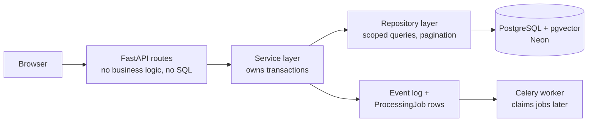
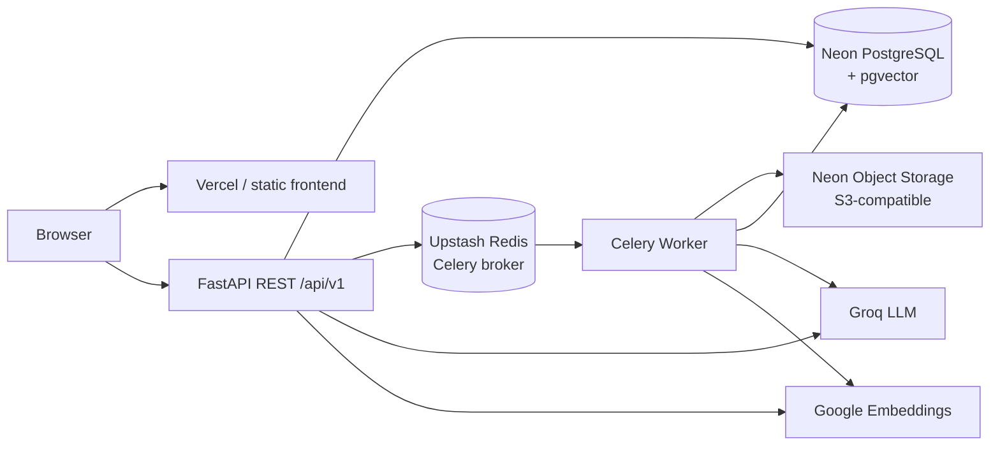
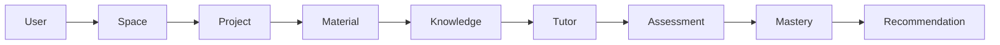
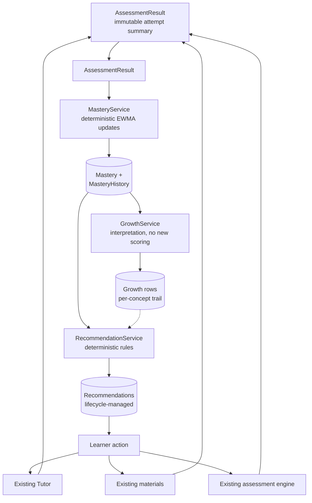
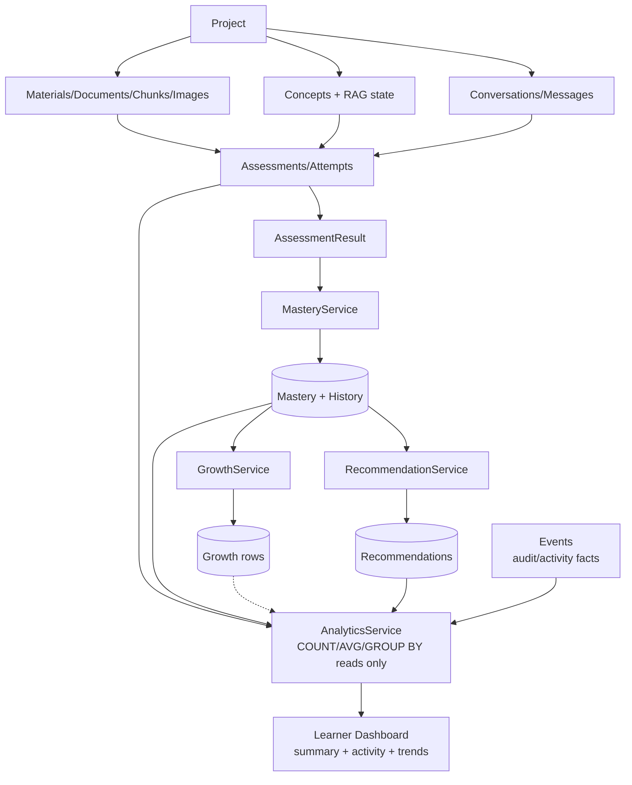
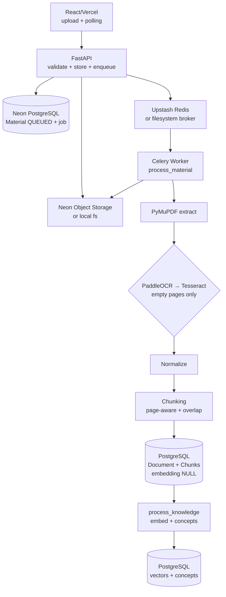
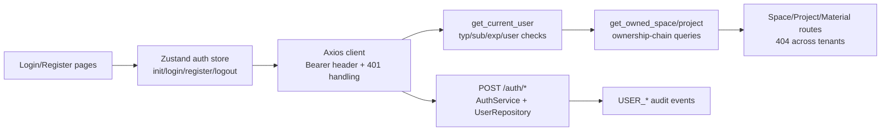
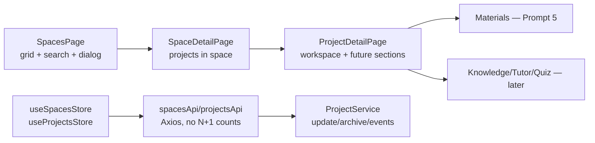
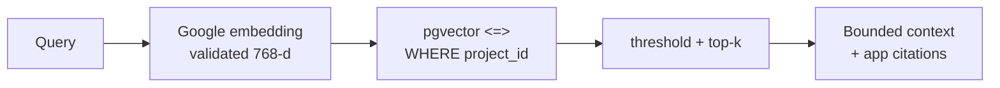
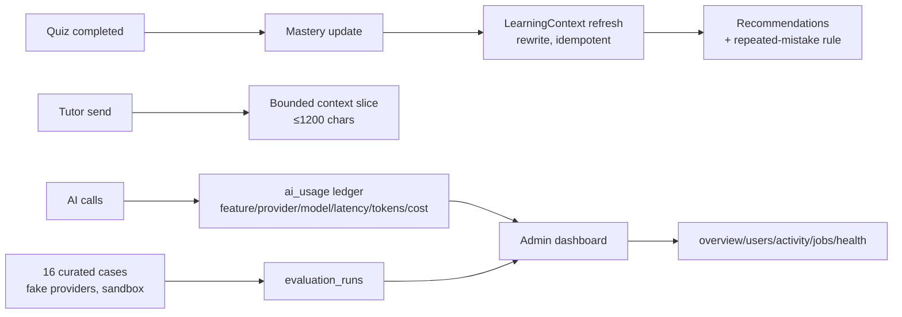

# Architecture

## Status: foundation (Prompt 1) + persistence (Prompt 2) + auth/authz (Prompt 3)
+ learning loop (Prompts 4–11) + hardening (Prompt 12) + storage migration
(Prompt 12B) + PRD gap closure (Prompt 12.5: admin, home/analytics, persistent
context, AI observability, evaluation)
+ knowledge/RAG (Prompt 6)
+ spaces/projects (Prompt 4) + materials pipeline (Prompt 5) implemented

## 0. Request path (implemented in Prompt 2)



Future components plug into fixed seams without restructuring: Groq/Google via
`app/ai/service.py`, RAG retrieval via `app/rag/` over `document_chunks.embedding`,
document pipeline via `processing_jobs` + `app/jobs/`, uploads via `app/storage/`
(referenced by `materials.storage_key`).

## 1. High-level system architecture (implemented as boundaries)



Boundaries: `app/ai/` (providers), `app/storage/` (Neon/local), `app/jobs/` (Celery),
`app/rag/` (retrieval contracts), `app/documents/` (extraction/chunking contracts).

## 2. Learning domain (IMPLEMENTED in Prompt 2 — 24 tables with later migrations through 0011)



## 2b. Assessment → Mastery → Growth → Recommendations loop (Prompts 8–10)



Real relationships (see docs/DATABASE.md for the ER diagram):

- Users 1—N Spaces; Spaces 1—N Projects (owner denormalized on Project, inherited at creation)
- Projects 1—N Materials → 0/1 Document → N Chunks (VECTOR(768)) + Concepts
- Conversations/Messages per (project, user); Quizzes/Questions/Attempts per project
- Question → Concept → Mastery path via `question_concepts`; Assessments feed MasteryHistory → Mastery → Growth → Recommendations
- Events + ProcessingJobs underpin observability and the async pipeline

## 2c. Analytics + events + dashboard (Prompt 11, read-only layer)



Layer discipline, stated once:

```text
Events        → audit/activity facts (append-only, sanitized payloads)
Analytics     → read-only aggregates over state + events (no new algorithms)
Mastery       → concept-level learning state (source of truth)
Growth        → interpretation of mastery (no new scoring)
Recommendations → actionable next steps (deterministic rules, lifecycle)
```

Analytics never writes learning data, never recomputes scores, and never
exposes private content (conversation bodies, answers, prompts, keys). All
aggregation is SQL-side (`COUNT`/`AVG`/`GROUP BY`, bounded `ORDER BY`,
indexed `project_id`/`user_id` filters); UTC grouping throughout, local-time
conversion at presentation only.

## 3. Async document processing (implemented in Prompt 5)



Rules that hold: HTTP never extracts (persists + enqueues, returns 201);
the worker needs no request context; one Document per Material (unique);
chunks carry `page_start`/`page_end`; `embedding` stays NULL; no LangChain,
no AI calls in ingestion. Details: `docs/DOCUMENT_PROCESSING.md`.

## 4. Authentication & authorization (implemented in Prompt 3)



- Frontend: `tokenStorage.ts` is the only token touchpoint; `RequireAuth` /
  `RedirectIfAuthenticated` guard routes with an explicit `initialized` flag so
  forms are never unmounted mid-submit; `?next=` preserves destinations.
- Backend: `app/auth/` owns policy, JWT (`sub/typ/iat/exp/jti`, 30-min default),
  service transactions, and dependencies. No roles exist (ownership-only model);
  isolation lives in scoped repository queries, proven by the HTTP IDOR matrix
  in `backend/tests/test_auth.py` plus the e2e register→reload→logout→login flow.

## 5. Spaces & Projects (implemented in Prompt 4)



- Routes: `/spaces`, `/spaces/:spaceId`, `/projects`, `/projects/:projectId`
  (protected; placeholders remain for materials/tutor/quizzes/mastery/growth).
- Deletion policy: archive-only (`archived_at`, reversible via `/restore`);
  hard deletes would orphan future Materials/Documents/Chunks/Concepts/Quizzes.
- Counts (`project_count`, `material_count`) come from single GROUP BY queries;
  search is escaped substring `ILIKE` — no search service (semantic search is RAG's job).
- Events: `SPACE_CREATED` (new enum value, migration `0003`) and
  `PROJECT_CREATED` (defined in Prompt 2, first emitted here) fire on creation.

## 6. Knowledge & RAG (implemented in Prompt 6)



- `RetrievalService` (`app/rag/retrieval.py`): auth → authorize → embed query →
  SQL-scoped cosine search → threshold/top-k → `RAGContext` with citations and
  an explicit `insufficient_evidence` flag. No Tutor yet — this is the
  foundation Prompt 7 consumes.
- `KnowledgeService` (`app/services/knowledge_service.py`): derived status
  (no new status columns), concept upserts with provenance merge, search
  delegation, reprocess. Background embedding/extraction in
  `app/jobs/knowledge_tasks.py` (atomic claims, per-batch commits, bounded
  retries). Details: `docs/RAG.md`, `docs/AI_ARCHITECTURE.md`.

## 7. PRD gap closure (Prompt 12.5)



- RBAC: `users.role` + `require_admin` (server-side) + `ADMIN_EMAILS`
  bootstrap; migration `0010_admin_context_aiusage` (single head preserved).
- Home (`GET /home`) and global analytics (`GET /analytics/summary`) reuse
  `AnalyticsService` aggregates — user-scoped, no new analytics engine.
- Evaluation (`app/evaluation/`): curated cases over real services with
  deterministic doubles; sandbox savepoints rolled back; only outcomes
  persist. Details: `docs/ADMIN.md`, `docs/LEARNING_CONTEXT.md`,
  `docs/AI_EVALUATION.md`, `docs/PRD_TRACEABILITY.md`.
