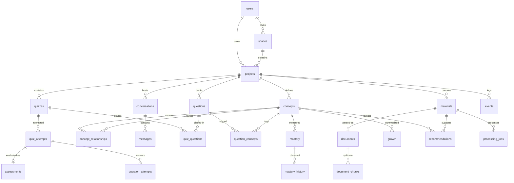

# Database

Status: **implemented in Prompt 2** (revision `0001_initial_domain`) with
additive later migrations through `0011_qattempt_created_at` (28 tables).

No analytics snapshot tables by design: aggregates compute live from domain
tables + the `events` audit stream (`COUNT`/`AVG`/`GROUP BY`, bounded windows,
indexed `project_id`/`user_id` filters). The four Prompt 12.5 tables are
*operational*, not snapshots: `users.role` (RBAC), `learning_contexts`
(derived per-project learner state), `ai_usage` (append-only provider-call
ledger), `evaluation_runs`/`evaluation_results` (eval outcomes).
Single database: Neon PostgreSQL + pgvector. No second database, no vector service.

## Entity overview

| Table | Purpose |
|---|---|
| `users` | Identity. Unique normalized email + `password_hash` (Argon2id). No tokens/keys. |
| `spaces` | Broad learning area owned by a user; parent of projects. |
| `projects` | Central workspace. `owner_id` denormalized from Space for O(1) authz. |
| `materials` | Logical learning resource (PDF first). Storage **reference** only + processing state machine (`QUEUED → PROCESSING → READY / FAILED`). |
| `documents` | One parsed representation per material (`uq`, evolves toward versioning). |
| `document_chunks` | RAG unit: ordered content + `VECTOR(768)` embedding. |
| `concepts` | Project-scoped knowledge nodes (`project + normalized_name` unique). |
| `concept_relationships` | Typed edges (`PREREQUISITE/RELATED/PART_OF/DEPENDS_ON`), composite FKs pin both ends to one project. |
| `conversations` / `messages` | Tutor sessions; messages append-only with light observability columns, no context dumps. |
| `quizzes` / `questions` | Content bank; MCQ options in JSONB (no `option_a/b/c/d` columns). |
| `quiz_questions` | Placement join, composite PK + per-quiz position uniqueness. |
| `question_concepts` | Question → Concept → Mastery path for adaptive assessment. |
| `quiz_attempts` | **Session**: user answering a quiz. |
| `question_attempts` | One answer per (attempt, question); open-ended evaluation breakdown in JSONB, aggregates as columns. |
| `assessments` | **Interpreted evaluation** derived from (usually one) attempt; feeds Mastery. One assessment per attempt. |
| `mastery` | Current (user, project, concept) score 0–100. Unique triple. |
| `mastery_history` | Immutable observations; never updated. `assessment_id` SET NULL so history outlives assessments. |
| `growth` | Derived interpretation, one row per triple, refreshed in place. Never writes mastery. |
| `recommendations` | Weak concept + material + action, with lifecycle (`ACTIVE/COMPLETED/DISMISSED/EXPIRED`). |
| `events` | Append-only activity log with JSONB payload. No `updated_at`. |
| `processing_jobs` | Background-work state (type, status, attempts, idempotency key, error). Pairs with Celery. |



## Primary keys / timestamps / enums

- **UUID PKs** (`sa.Uuid`, app-generated `uuid4`); portable (native UUID on PG, CHAR(32) on SQLite). FKs type-compatible everywhere.
- **UTC timestamps**: `DateTime(timezone=True)`, ORM default `datetime.now(UTC)` + `server_default=now()` backstop. Mutable entities get `created_at/updated_at`; append-only ones (`messages`, `events`, `mastery_history`, attempts' answers) get `created_at` only.
- **Enums**: centralized `StrEnum`s in `app/models/enums.py`, persisted as native PG ENUMs (migration creates/drops all 16 types). No magic strings.

## Project isolation

- Schema: every project-owned row carries `project_id` (+ `owner_id` on Project for authz); `ConceptRelationship` uses composite FKs so cross-project edges are **rejected by the database**.
- Access: repositories expose only scoped methods (`get_project_for_user`, `get_material_for_project`, …) returning `None` on mismatch; `ProjectService.require_project` is the service-layer gate. Proven by `tests/test_project_isolation.py` (two-tenant matrix).

## Transactions

Repositories add/flush, never commit. Services own the boundary via `@transactional`
(commit on success, rollback + log on error), so e.g. mastery + history + event land
atomically. For simple request flows, `get_db` commits on exit. Proven by
`tests/test_services.py` (atomic commit + injected-failure rollback).

## Indexing

Single-column indexes on every FK/status/type column used in `WHERE`; composites for
real paths: `(space, owner)`, `(project, user)`, conversation history
`(conversation, created_at)`, events `(project, created_at)`, mastery history
`(mastery, created_at)`. Join tables rely on composite PKs + reverse-direction
indexes (`quiz_questions.question_id`, `question_concepts.concept_id`).

## pgvector strategy

- Column `document_chunks.embedding VECTOR(768)` — 768 is the fixed output dim of the
  configured model `models/text-embedding-004` (`EMBEDDING_DIMENSIONS` in
  `app/models/mixins.py`). Changing models requires an explicit migration; dims are
  never mixed silently.
- **No approximate vector index yet (deliberate):** pgvector recommends HNSW/IVFFlat
  past ~10k+ vectors; at assignment scale exact scan scoped by `project_id` (btree) is
  faster and maintenance-free. Add `HNSW ... vector_cosine_ops` in a new migration past
  ~100k chunks. Migration enables the extension: `CREATE EXTENSION IF NOT EXISTS "vector"`.
- SQLite tests substitute `JSON` via `with_variant` (storage shape only, no semantics).

## Deletion / archiving

- Ownership chain (`user → space → project → everything`) cascades — deleting a user
  cleans up (GDPR-friendly).
- Spaces and Projects are **archived, never hard-deleted** by the API
  (`DELETE` sets `archived_at`; `POST /{id}/restore` reverses). Rationale: every
  future entity (Materials → … → Recommendations) hangs off Project, so a hard
  delete would silently destroy learning history. Archived rows are excluded from
  all reads by default (`include_archived=True` only for the restore path).
- Otherwise business lifecycle uses `archived_at` / status enums (Material, Quiz,
  Recommendation). History (`events`, attempts, `mastery_history`) is never deleted by
  app code; dangling references use `SET NULL` (events, history→assessment, rec links);
  `QuestionAttempt.question_id` is `RESTRICT` so answers survive question-bank edits.

## Pagination

`BaseRepository.paginate`: limit/offset with clamped page size (default 20, max 100),
returns `(items, total)`. Offset chosen over cursors: collections are small and pages
are user-facing; revisit if event tables grow hot.

## Migration workflow

```bash
cd backend
alembic history            # no DB needed
alembic upgrade head       # requires DATABASE_URL (PostgreSQL)
alembic downgrade -1       # drops tables + enum types (extension stays installed)
alembic revision --autogenerate -m "..."   # after model changes, review the diff
```

`alembic/versions/0001_initial_domain.py` is explicit (not autogenerated blindly) and
imports enum definitions from `app.models.enums` — single source of truth.
